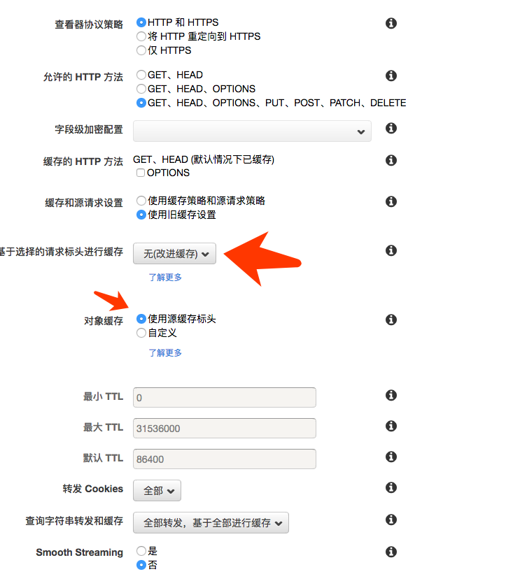
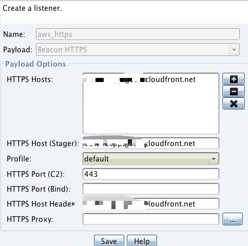

Title: Domain Fronting隐藏HTTPS
Date: 2020-08-28
Category: Pentest
Slug: cloudfont-domain-fronting-https

记录一下当使用`Domain Fronting`中使用`https`来上线时候的坑，因为查了半圈没有找到类似的资料，为啥非要https呢，因为`node32`对http的流量很敏感。

###目标

1. 使用`Windows/beacon_https/reverse_https`作为上线的payload
2. AWS的`Cloudfront`作为前置域名

####准备工作

```
域名: example.com
VPS(Centos)
cloudflare(只作域名解析,不添加任何其他功能，不加CDN，不加HTTPS)
```


####HTTPS的连通性

安装的apache是测试连通性，除此之外没有任何用处。

```
yum install httpd
systemctl start httpd
```

#####增加apache配置文件

```
#/etc/httpd/conf.d/vhost.conf
<VirtualHost *:80>
   DocumentRoot /var/www/html
   ServerName example.com


RewriteEngine on
RewriteCond %{SERVER_NAME} =example.com
RewriteRule ^ https://%{SERVER_NAME}%{REQUEST_URI} [END,NE,R=permanent]
</VirtualHost>
```

#####设置https
运行脚本`HTTPsC2DoneRight.sh`生成对应需要的文件，比如`letsencrypt`、`amazon.profile`等文件，这个时候https会自动设置成功，测试如下:

```
curl http://example.com
curl https://example.com
```

这时候会生成https通信需要的证书文件，一般是通过自签名Letsencrypt申请下来的：

```
./letsencrypt-auto certonly --standalone -d 域名 --email 邮箱（可匿名）

openssl pkcs12 -export -in fullchain.pem -inkey privkey.pem -out pkcs.p12 -name 域名 -passout pass:ABcd123456

keytool -importkeystore -deststorepass ABcd123456 -destkeypass ABcd123456 -destkeystore keystore.store -srckeystore pkcs.p12 -srcstoretype PKCS12 -srcstorepass ABcd123456 -alias 域名

```
生成的keystore是后面设置CS配置文件的时候使用。

###设置CloudFront

标红的点特别注意，要改成这个样子，否则测试失败。更改之后发布，测试此时的`CloudFront`是否生效:

```
curl https://<example>.cloudfront.net
curl http://<example>.cloudfront.net
```





###设置Profile

生成Profile，上面生成的`amazon.profile`测试上线失败。

```
cd && git clone https://github.com/bluscreenofjeff/Malleable-C2-Randomizer && cd Malleable-C2-Randomizer
python malleable-c2-randomizer.py -profile Sample\ Templates/Pandora.profile -notest
cp pandora_<random>.profile /root/cobaltstrike/httpsProfile/ 
```

####修改profile

1. 把amazon.profile的最后四行设置https的添加到pandora_<random>.profile里面。
2. 修改`pandora_<random.profile`里面的`Host`，改为aws申请下来的加速域名。
3. 在profile文件最后新增配置：

```
https-certificate {
set keystore "keystore.store";
set password "1234565";
}
http-config {
	set trust_x_forwarded_for "true";
}
```

###设置CS

```
systemctl stop httpd  //关闭apache
./teamserver <IP> <Pass> <path to pandora profile>
```

新建一个listener:



查看CS的`WEBlog`:

```
curl https://cloudfront.net/Hello
```

在weblog里面查看到对应的请求即设置成功。


###参考资料
 
* <https://www.blackhillsinfosec.com/using-cloudfront-to-relay-cobalt-strike-traffic/>
* [Domain Fronted仍然是最佳的C2隐藏手段](https://www.cnblogs.com/donot/p/13921874.html)