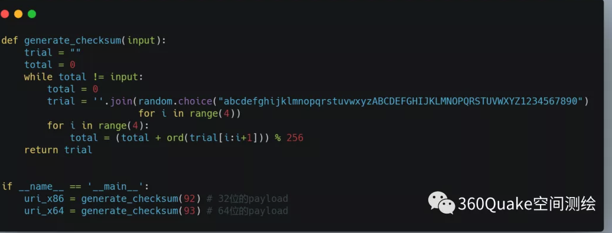

Title: CobaltStrike的Stager特征隐藏
Category: Pentest
Slug: cobaltstrike-stager-beacon-grab
Date: 2021-1-4


### 背景

在github上面出现一个仓库分析`CobaltStrike`监听端口的特征：[https://github.com/Te-k/cobaltstrike](https://github.com/Te-k/cobaltstrike)。CS在监听Stager端口的时候，会通过URI下载Payload执行，这个URI生成的规则生成：


	
### DomainFront

根据360的空间测绘，看完之后第一时间想到的是通过fofa这类空间测绘找出特征，然后找出来设置了DomainFront的C2，想看看这些C2
的原始域名和设置C2的域名是什么情况，大家都用的什么作为域名前置的 :)

#### Quake测绘
根据360给出的搜索条件，先找出来一批IP地址:

```
response:"HTTP/1.1 404 Not Found" AND response:"Content-Type: text/plain" AND response:"Content-Length: 0" AND NOT response:"Server: " AND NOT response:"Connection: " AND port: "443"   AND NOT country: "China"
```

#### 修改脚本

修改好之后的脚本和扫描结果:[https://github.com/JKme/cobaltstrike](https://github.com/JKme/cobaltstrike)。把单线程改为多线程，再增加一个获取IP的https证书域名函数：

```
def get_subject(hostname):
    try:
        dst = (hostname, 443)
        s = socket.socket(socket.AF_INET, socket.SOCK_STREAM)
        s.connect(dst)
        ctx = ssl.create_default_context()
        ctx.check_hostname = False
        ctx.verify_mode = ssl.CERT_NONE
        s = ctx.wrap_socket(s, server_hostname=dst[0])
        cert_bin = s.getpeercert(True)
        x509 = crypto.load_certificate(crypto.FILETYPE_ASN1, cert_bin)
        val = x509.get_subject().CN
    except Exception as e:
        val = str(e)
    return val
```

### 扫描结果

* 最多使用的`GET URI`是`submit.php`
* 除了aws的`CloudFront`作为最多的域前置，还有使用aws的网关域名，猜测使用了https流量转发或者直接接入到网关。
* 还有使用了巨硬家的域名，那这种就是`Domain takeover`来获取到的

### 防御

如果是使用了AWS家的`CloudFront`作为域前置，可以设置防火墙规则，只允许属于`CloudFront`的域名流量，其他IP请求过来的流量丢掉，操作如下:

```
0x01:  获取到CloudFront的所有IP
http http://d7uri8nf7uskq.cloudfront.net/tools/list-cloudfront-ips |jq ".[][]" | sed 's/"//g' | tee /tmp/cloud.txt

0x02: 使用ipset新增IP集合
ipset create cloudfront hash:net
while read line; do ipset add cloudfront $line; done < /tmp/cloud.txt
ipset list cloudfront

0x03: 新增IPtables规则
iptables -A INPUT -p tcp  --dport 443 -j DROP
iptables -I INPUT -m set --match-set cloudfront  src -p tcp  --dport 443 -j ACCEPT
```

当然，也可以直接修改CS的源代码重新打包。

### 参考

 * [浅析CobaltStrike Beacon Staging Server扫描](https://mp.weixin.qq.com/s/BLM8tM88x9oT4CjSiupE2A)
 * [针对CobaltStrike中出现的Stager监听端口特征后门分析](https://www.cnblogs.com/donot/p/14226788.html)