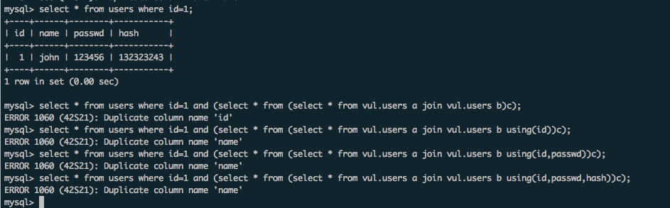

Title: lctf3-他们有什么秘密呢
Category: CTF
Date: 2017-11-22
slug: lctf3-they-have-secert

waf拦截了information_schema、columns、tables、databse、schema等关键词或函数，如何获取当前表名，字段名和库名？

pro_id,pro_name,owner,d067a0fa9dc61a6e

<http://www.wupco.cn/?p=4117>
上面是第一种方法。

第二种方法，使用order by盲注
