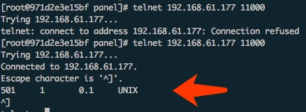

Title: Pycharm远程调试Docker
Category: Python
Date: 2019-12-13
Slug: python-debug

调试的流水账:

原理就是pycharm作为server，远程要debug的是client。在client要安装pycharm-debug.egg，安装之后

```
python -m easy_install pycharm-debug.egg
```

```
import pydevd
```

没毛病就表示安装成功。

这个pycharm的包一般在这个目录:

```
/Applications/PyCharm.app/Contents/debug-eggs
```

然后配置pycharm:

```
在Preferences -> project 会有当前项目，可以先设置 project Interpreter，但是如果单单为了调试，这个不用设置就可以。为了测试方便可以添加一个sftp同步:

Flie->Setting->Build,Exception,Deployment->Deployment

添加和Docker相关的端口和IP，举例来说把Docker的22端口映射到本机的20022。设置完了之后，可以在这里同步代码:

Tools->Deployment->Sync with deploymed to sftp
```
经过上面的步骤现在有了一个sftp来同步本地的代码和远程的代码，然后设置使用pydevd来远程调试。

在Run/Debug configurations里面，选择添加Python Remote Debug。

其中的`local host name`要设置为pycharm机子的IP，PORT随便填，比如11000。
设置完成之后，注意设置下Path Mappings，设置好本地主机的路径源代码和远程的路径。如果这里不设置好，在调试的时候Py


最后把两行代码加到要debug的机子文件上,注意把pycharm-debug.egg添加到路径里面:

```
import sys
sys.path.append('/root/pycharm-debug.egg')

import pydevd
pydevd.settrace('192.168.140.40', port=10000, stdoutToServer=True, stderrToServer=True)
```

这个时候已经设置全部完成，本地的pycharm启动远程调试，然后在docker上面启动Python应用。

如果不确定本地的pycharm是不是启动成功了，可以telnet一下对应的端口，会有类似这种内容出现:




```
strace -p 27691 -e trace=read,write -s 1024
```

调试的时候可以看读写调用。

### SSH Remote Debug
如果是ssh的Remote Debug，在设置interpreter的时候，设置远程服务器的python解释器就可以了，在Docker里面之所以ssh类型的远程调试失败，应该是Docker的端口没有映射到本地造成的。