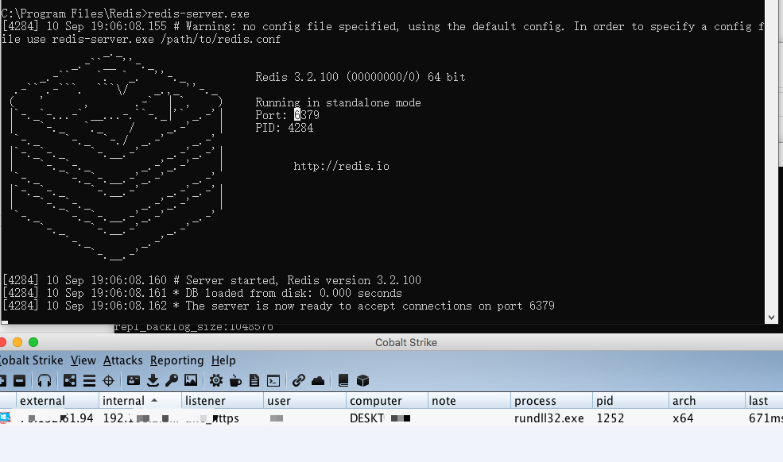

Title: Redis On Windows -- Dll Hijack
Category: Pentest
Slug: redis-on-windows-dll-hijack
Date: 2020-09-10


本文测试了Redis在Windows平台下的dll劫持，主要参考文章是先知的秋水师傅: [Redis on Windows 出网利用探索](https://xz.aliyun.com/t/8153)

###测试环境

```
Redis-x64-3.2.100
Win10
```

###可劫持的DLL

按照文章中使用`Process Monitor`，在使用`redis-cli`操作的时候，观察缺失的DLL。在`Process Monitor Filter`里面设置`Image Path`的值为`redis-server.exe`的路径，比如我的是`C:\Program Files\Redis\redis-server.exe`，`Path`设置为`ends with dll`。设置好之后，使用`redis-cli`连接，执行`bgsave`命令，然后观察缺失的dll，有如下:

```
HKLM\System\CurrentControlSet\Control\Srp\GP\DLL
C:\Program Files\Redis\dbghelp.dll
C:\Windows\System32\edgegdi.dll
C:\Windows\System32\symsrv.dll
```


当`redis-server.exe`启动的时候，有如下:

```
C:\Windows\System32\edgegdi.dll
C:\Windows\System32\symsrv.dll
C:\Program Files\Redis\CRYPTBASE.DLL
```


执行`BGREWRITEAOF`的时候，有如下:

```
HKLM\System\CurrentControlSet\Control\Srp\GP\DLL
C:\Program Files\Redis\dbghelp.dll
C:\Windows\System32\edgegdi.dll
C:\Windows\System32\symsrv.dll
```

最终在Redis目录下可以利用的有两个:`cryptbase.dll`和`dbghelp.dll`。如果是权限持久性控制，两个都可以，这里我们选择主动攻击，所以使用`dbghelp.dll`。


###DLLHijacker

使用kiwings师傅的[DLLHijacker](https://github.com/kiwings/DLLHijacker)，因为在系统里面是存在`C:\Windows\System32\dbghelp.dll`的，所以，复制出来之后，运行脚本，生成DLL工程项目。修改里面的shellcode和dbghelp.dll的绝对路径。

在实际测试的时候，运行脚本报错，所以修改了一部分代码: <https://github.com/JKme/sb_kiddie-/tree/master/dll_hijack>

把生成的dll重命名为`dghelp.dll`放在redis的安装目录，然后执行`bgsave`或者`redis-server`启动的时候会执行shellcode。




###测试结果

在实际的渗透测试中，使用[RedisWriteFile](https://github.com/r35tart/RedisWriteFile)写入文件的时候，因为使用的是主从复制，会把redis里面的数据清空，这样攻击之后可能会被发现，所以可以这样做:

##### 备份redis

* [redis-dump-go](https://github.com/yannh/redis-dump-go)

```
备份:
./redis-dump-go -host 192.168.2.233 -output commands > redis.dump


恢复:
redis-cli -h 192.168.2.233 < redis.dump
```