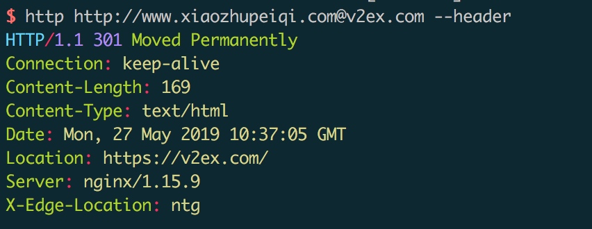
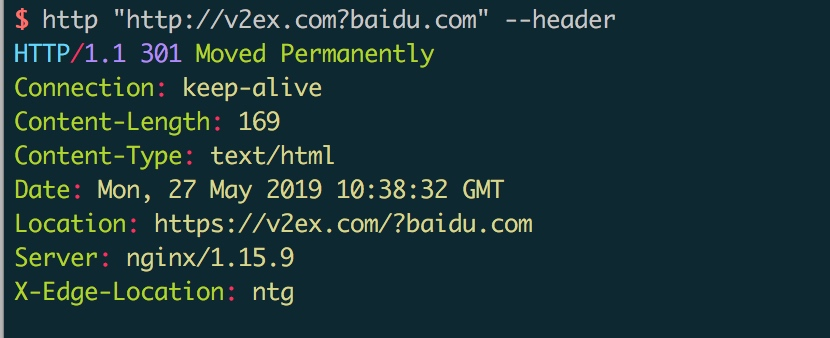
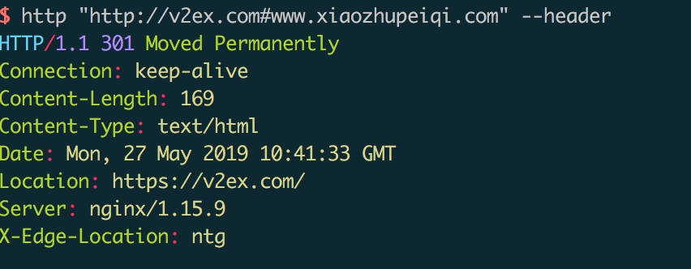
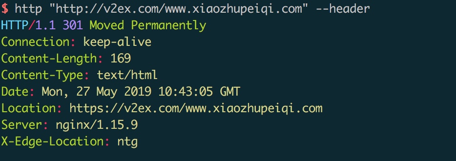
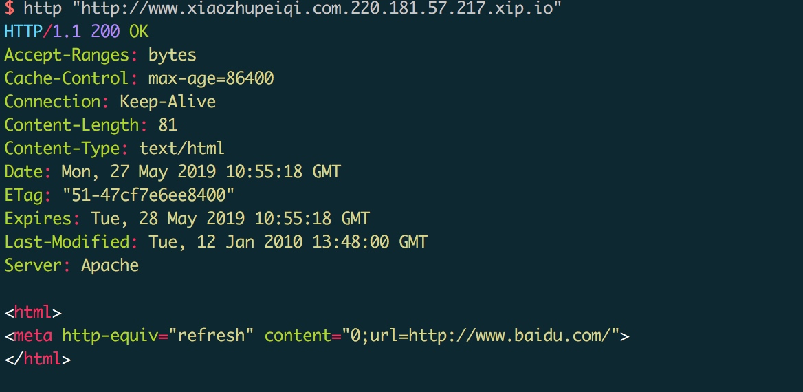

Title: Web的URL Hacking
Category: Pentest
Slug: web-hacking-url
Date: 2019-05-27


碰到一个任意URL跳转漏洞，第一次测的时候居然没有测出来，记录下笔记，以下是绕过的方式:

###0x01: 小老鼠跳转绕过



###0x02: ?跳转绕过



###0x03: #绕过



###0x04: /绕过



###0x05: \绕过


```
\在浏览器会自动转变为/

 http:/\/baidu.com
 http:\//baidu.com
  /\/baidu.com
 http:\\\//baidu.com
```
 
###0x06: 子域名绕过

比如 v2ex.com.xiaozhupeiqi.com, 最后会跳转到xiaozhupeiqi.com，攻击者控制的域名。


###0x07: xip.io 绕过
类似子域名绕过，比如请求127.0.0.1.xip.io,会自动解析到127.0.0.1，下面的会自动跳转到baidu.com




##URL Hacking

这部分是从wooyun的文章摘过来的，我记得很清楚，这个作者之前在zone里面回答过我一个问题，那时候我是个菜鸟,那时候我看漏洞的时候甚至不知道怎么看一个ID是`/fd`报的漏洞。(wooyun 你好，wooyun再见)。

这部分有两个地方感觉比较有意义:

1. URL八进制

```
http://0[八进制] 比如 115.239.210.26 首先用.分割数字 115 239 210 26 然后选择10进制转换16进制！

(要用0来表示前缀，可以是一个0也可以是多个0 跟XSS中多加几个0来绕过过滤一样！)
首先把这四段数字给 转成 16 进制！结果：73 ef d2 1a  然后把 73efd21a 这十六进制一起转换成8进制！
结果就是: http://0016373751032
```

2. Punycode


